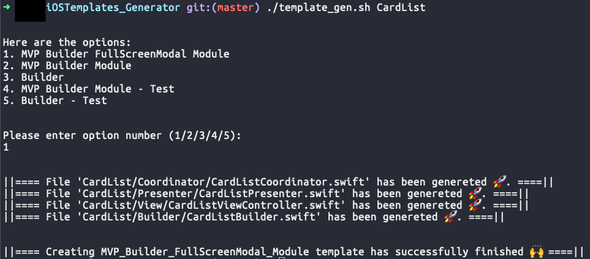

# Templates Generator

Auto generate templates for iOS project.

## How to use

1. Clone the project.
2. `cd` to `iOSTemplates_Generator`
3. Run with format `./template_gen.sh <feature name>`, then option list will be showing.
4. Choose option, after execution, a folder name as `feature name` will be shown on your screen, for example: if you choose to create `MVP Builder FullScreenModal Module` with feature name as `CardList`, the folder that is showing on screen will be named as `CardList`.
5. Drag the output folder in XCode project to use.

## Notice

Please update the Templates - which are located in `Original` folder in each template folder, if there is any update.

## Reference

- [xcode-custom-template](https://diamantidis.github.io/2019/07/21/xcode-custom-templates)